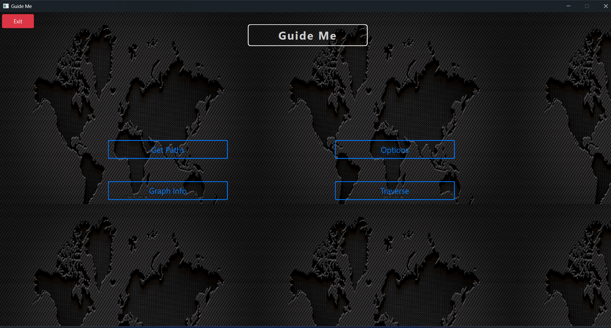
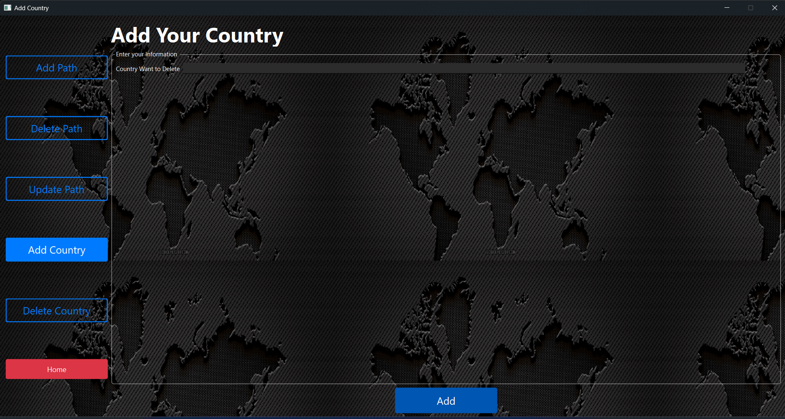
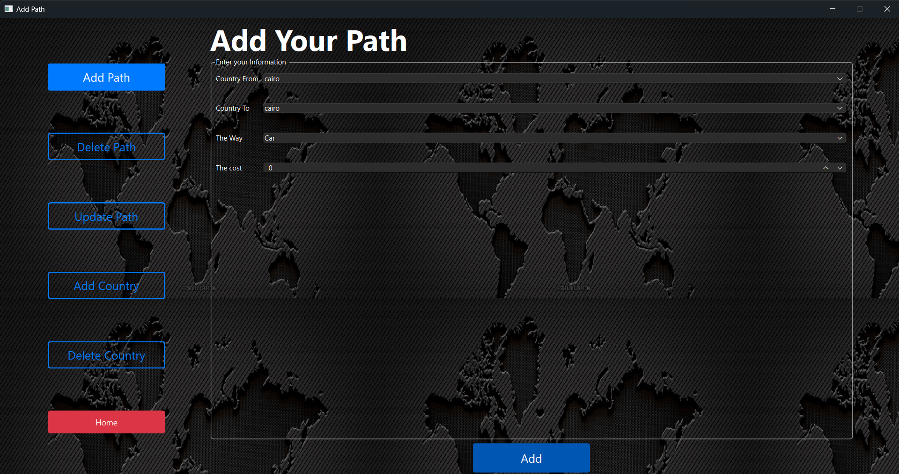
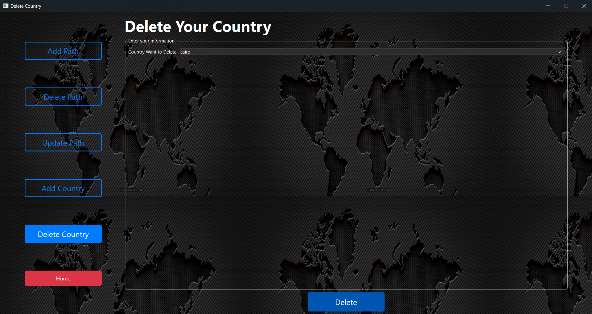
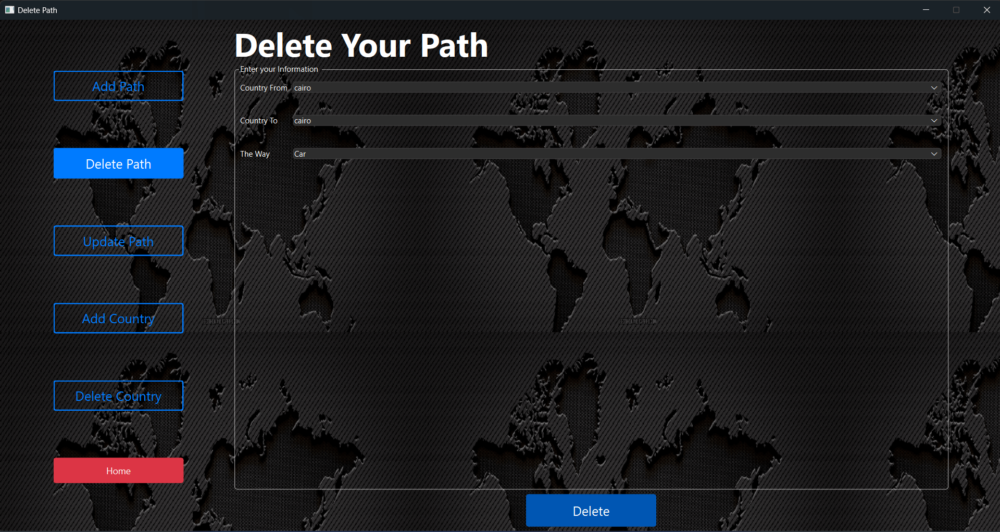
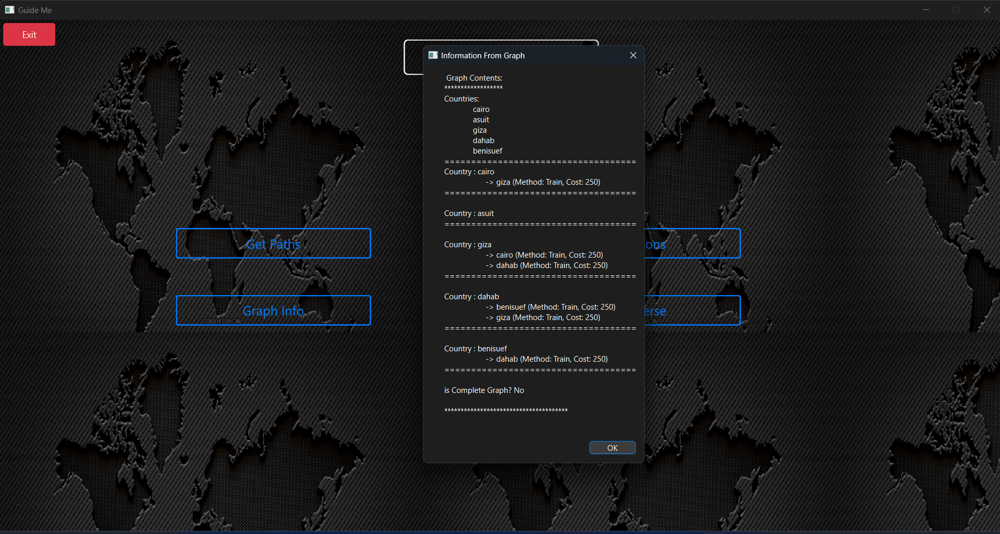
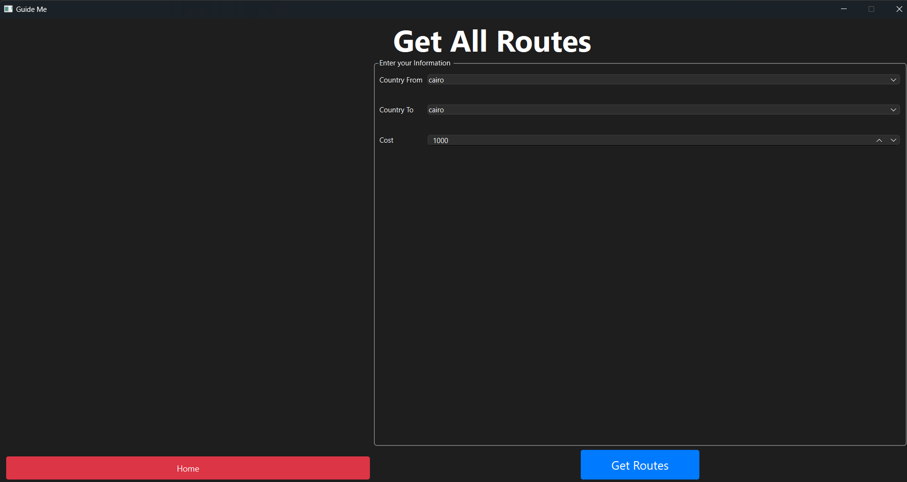
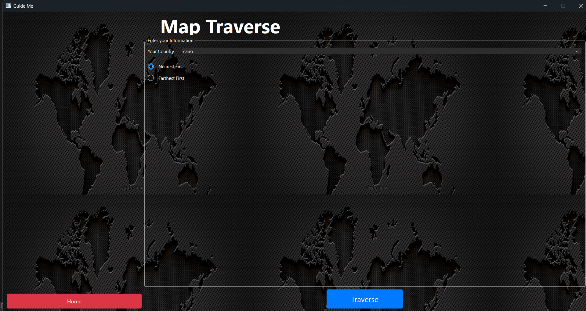

# DS-Project

 

  

    Travel Guide Project made for the Data Structure Project course at Faculty of Computer and Information Science, Ain Shams University.
     
     
     
     
  

  
Table of Contents

  <ol>
    <li>
      <a href="#about-the-project">About The Project</a>
    </li>
    <li>
      <a href="#system-description">System Description</a>
      <ul>
        <li><a href="#classes-and-methods">Classes and Methods</a></li>
      </ul>
    </li>
    <li><a href="#usage">Usage</a></li>
  </ol>

# About The Project

This comprehensive and feature-rich system is designed to streamline the process of planning travel routes between countries, offering both users and administrators an intuitive and efficient platform. With functionalities ranging from adding and deleting countries and travel paths to searching for paths between countries with specific constraints, this system aims to provide a seamless experience for both travelers and administrators.

### Built With

* [![C++][C++.js]][C++-url]
* [![Qt][Qt.js]][Qt-url]

<a href="#readme-top">back to top</a>

# System Description

### Classes and Methods

#### Travel Method
- **Public Arguments:**
  - `String Name`: Name of Transportation
  - `int Cost`: Cost of Transportation
- **Constructors:**
  - Default Constructor
  - Parameterized Constructor

#### Graph
- **Private Arguments:**
  - `unordered_map<string, set<pair<TravelMethod, string>>> Graph`: To save Graph
- **Private Methods:**
  - `Write()`: Writes the graph data to a file
  - `Read()`: Reads the graph data from a file
- **Public Void Methods:**
  - `Add Path(String country1, String country2, String methodName, int cost)`: Adds a new path from `country1` to `country2`
  - `Update Path(String country1, String country2, String methodName, String newMethodName, int newCost)`: Updates the path between `country1` and `country2`
  - `Delete Path(String country1, String country2, String methodName)`: Deletes the path between `country1` and `country2`
  - `Add Country(String country)`: Adds a new country to the graph
  - `Delete Country(String country)`: Deletes a country from the graph
- **Public Bool Method:**
  - `Is Complete()`: Returns `true` when the graph is complete
- **Public List<String> Methods:**
  - `All Countries()`: Returns all countries in the graph
  - `BFS(String StartNode, unordered_map<string, bool> visited)`: Traverses the graph using the BFS algorithm
  - `DFS(String StartNode, unordered_map<string, bool> visited)`: Traverses the graph using the DFS algorithm
- **Public Method to Get Paths:**
  - `set<pair<long, list<pair<TravelMethod, string>>>> Get Paths(String country1, String country2, Long Cost, unordered_map<string, bool> visited)`: Returns all paths between `country1` and `country2` that don’t exceed the maximum cost, sorted by cost

<a href="#readme-top">back to top</a>

# Usage

## Input and Output Scenarios:
### **Add Country**

  * **Input:** User enters the `Country` name
  * **Output:** Adds a new country to the graph

### **Add Path**

  * **Input:** User enters `Country 1`, `Country 2`, `Cost`, and `Transportation Method`
  * **Output:** Adds a new path between the entered countries

### **Delete Country**

  * **Input:** User enters the `Country` name
  * **Output:** Deletes the country from the graph

### **Delete Path**

  * **Input:** User enters `Country 1`, `Country 2`, and `Transportation Method`
  * **Output:** Deletes the path between the entered countries

### **Update Path**

  * **Input:** User enters `Country 1`, `Country 2`, `Old Transportation Method`, `New Transportation Method`, and `New Cost`
  * **Output:** Updates the path between the entered countries

### **Graph Info**

  * **Output:** Displays all countries in the graph

### **Get Paths**

* **Input:** User enters `Country 1` and `Country 2`
* **Output:** Displays all paths between the entered countries within the maximum cost

### **Traverse**
* **Input:** User enters `Country 1` and `Country 2`
* **Output:** Displays all paths between the entered countries, sorted by nearest first or farthest first from `Country 1`

<a href="#readme-top">back to top</a>

<!-- MARKDOWN LINKS & IMAGES -->
<!-- https://www.markdownguide.org/basic-syntax/#reference-style-links -->
[C++.js]: https://img.shields.io/badge/C++-00599C?style=for-the-badge&logo=c%2B%2B&logoColor=white
[C++-url]: https://www.cplusplus.com/
[Qt.js]: https://img.shields.io/badge/Qt-41CD52?style=for-the-badge&logo=Qt&logoColor=white
[Qt-url]: https://www.qt.io/
